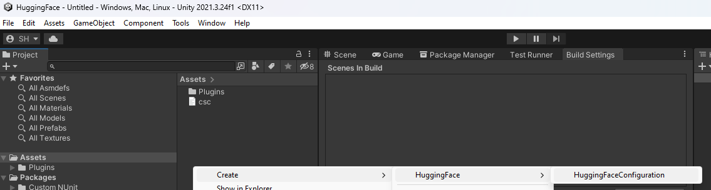

# com.rest.huggingface

[](https://openupm.com/packages/com.rest.huggingface/)

A non-official [HuggingFace](https://huggingface.co/) RESTful client for the [Unity](https://unity.com/) Game Engine.

I am not affiliated with BlockadeLabs and an account with api access is required.

***All copyrights, trademarks, logos, and assets are the property of their respective owners.***

## Installing

Requires Unity 2021.3 LTS or higher.

The recommended installation method is though the unity package manager and [OpenUPM](https://openupm.com/packages/com.openai.unity).

### Via Unity Package Manager and OpenUPM

- Open your Unity project settings
- Select the `Package Manager`

- Add the OpenUPM package registry:
  - Name: `OpenUPM`
  - URL: `https://package.openupm.com`
  - Scope(s):
    - `com.rest.huggingface`
- Open the Unity Package Manager window
- Change the Registry from Unity to `My Registries`
- Add the `HuggingFace` package

### Via Unity Package Manager and Git url

- Open your Unity Package Manager
- Add package from git url: `https://github.com/RageAgainstThePixel/com.rest.huggingface.git#upm`
  > Note: this repo has dependencies on other repositories! You are responsible for adding these on your own.
  - [com.utilities.async](https://github.com/RageAgainstThePixel/com.utilities.async)
  - [com.utilities.audio](https://github.com/RageAgainstThePixel/com.utilities.audio)
  - [com.utilities.rest](https://github.com/RageAgainstThePixel/com.utilities.rest)

## Documentation

### Table of Contents

- [Authentication](#authentication)
- [Hub](#hub)
- [Inference](#inference)

### Authentication

There are 4 ways to provide your API keys, in order of precedence:

1. [Pass keys directly with constructor](#pass-keys-directly-with-constructor)
2. [Unity Scriptable Object](#unity-scriptable-object)
3. [Load key from configuration file](#load-key-from-configuration-file)
4. [Use System Environment Variables](#use-system-environment-variables)

#### Pass keys directly with constructor

```csharp
var api = new HuggingFaceClient("yourApiKey");
```

Or create a `HuggingFaceAuthentication` object manually

```csharp
var api = new HuggingFaceClient(new HuggingFaceAuthentication("yourApiKey"));
```

#### Unity Scriptable Object

You can save the key directly into a scriptable object that is located in the `Assets/Resources` folder.

You can create a new one by using the context menu of the project pane and creating a new `HuggingFaceConfiguration` scriptable object.



#### Load key from configuration file

Attempts to load api keys from a configuration file, by default `.huggingface` in the current directory, optionally traversing up the directory tree or in the user's home directory.

To create a configuration file, create a new text file named `.huggingface` and containing the line:

##### Json format

```json
{
  "apiKey": "yourApiKey",
}
```

You can also load the file directly with known path by calling a static method in Authentication:

```csharp
var api = new HuggingFaceClient(HuggingFaceAuthentication.Default.LoadFromDirectory("your/path/to/.huggingface"));;
```

#### Use System Environment Variables

Use your system's environment variables specify an api key to use.

- Use `HUGGING_FACE_API_KEY` for your api key.

```csharp
var api = new HuggingFaceClient(HuggingFaceAuthentication.Default.LoadFromEnvironment());
```

### Hub

TODO

### Inference

TODO